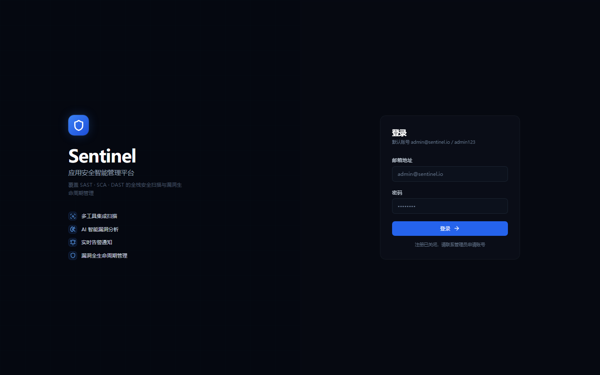
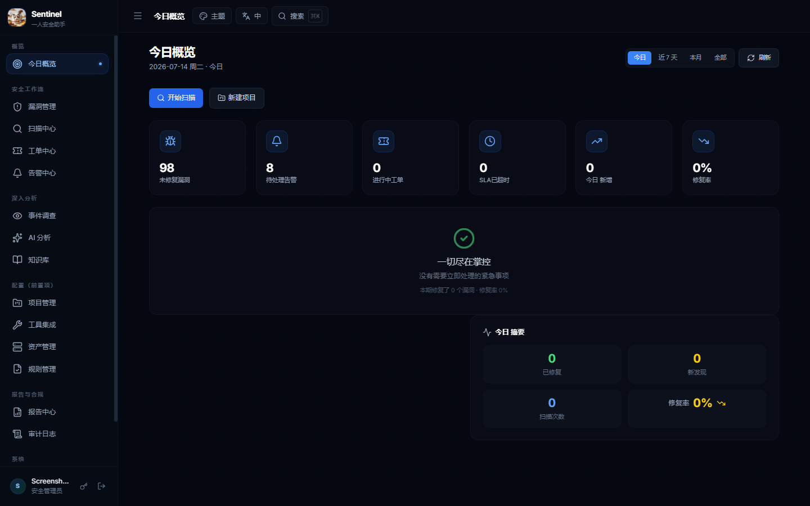
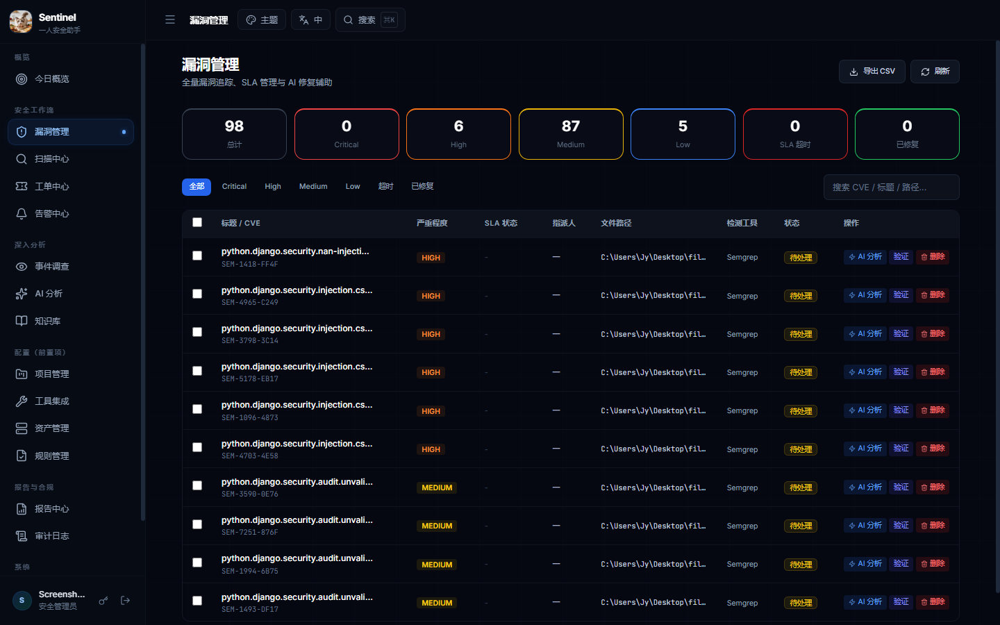
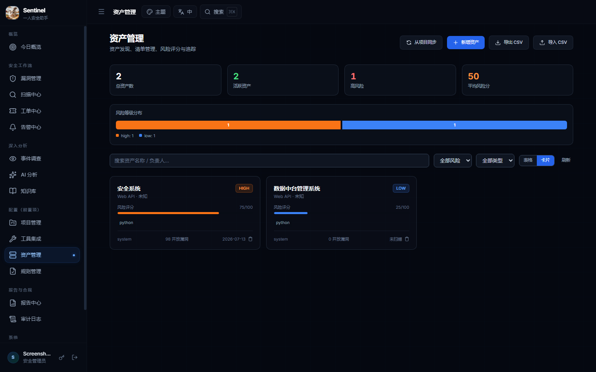
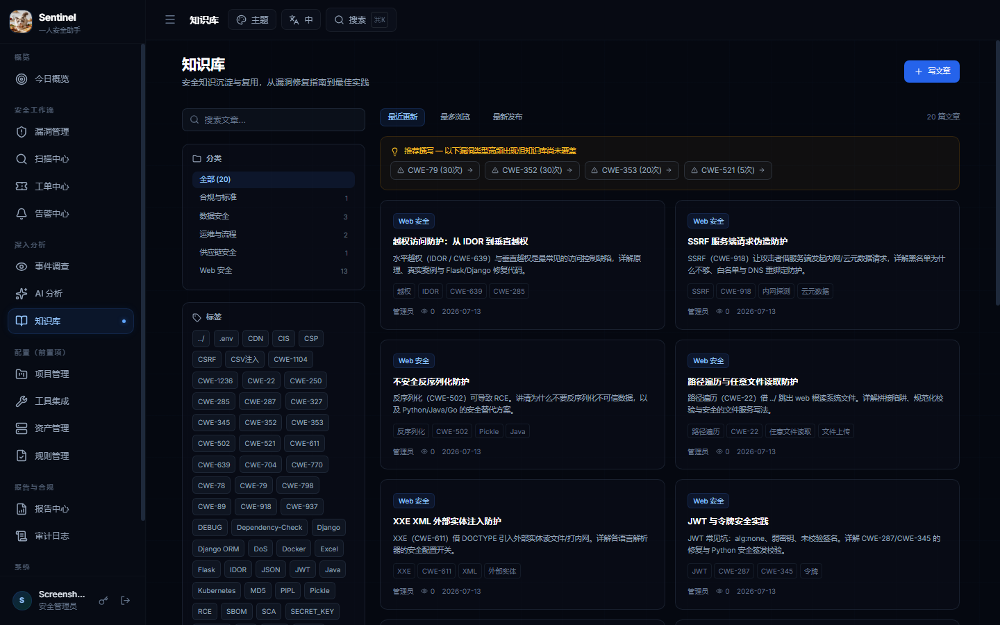
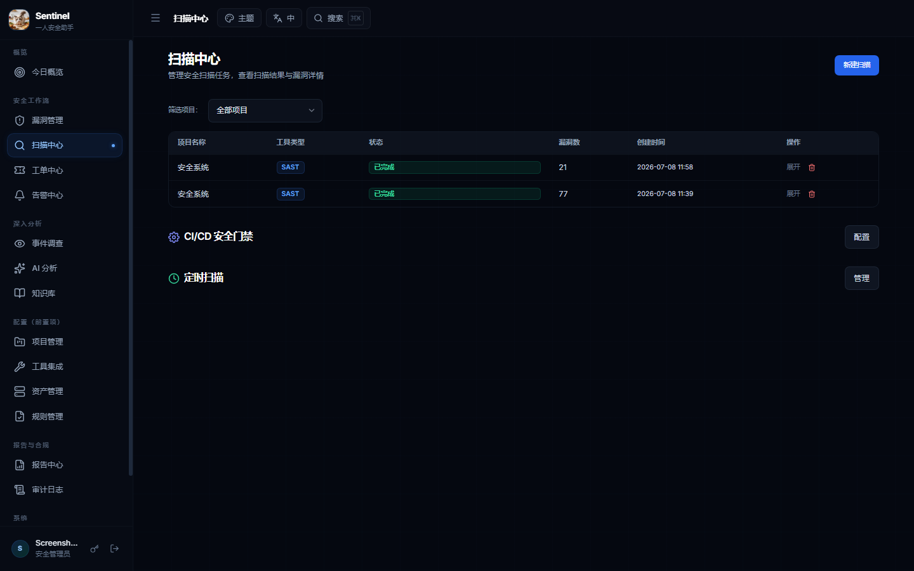
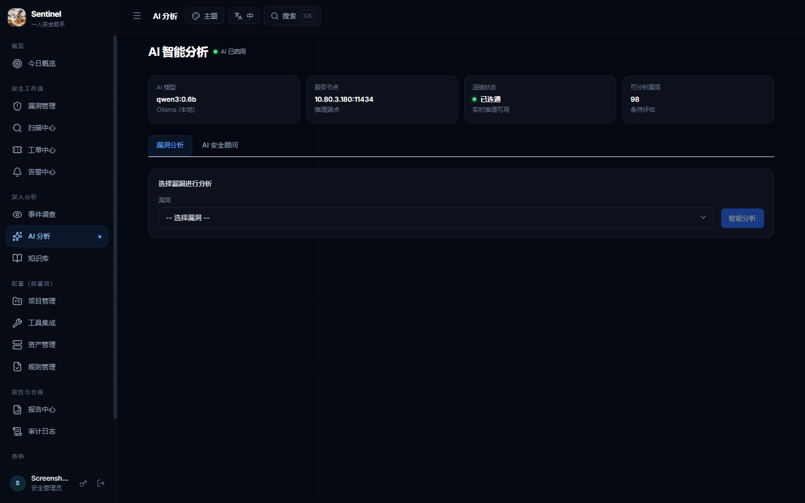
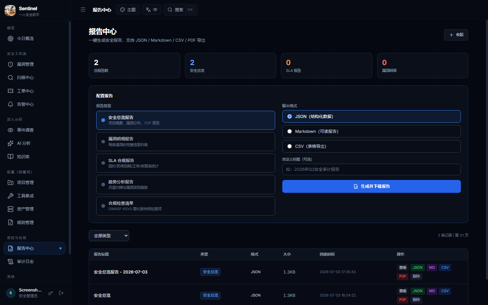
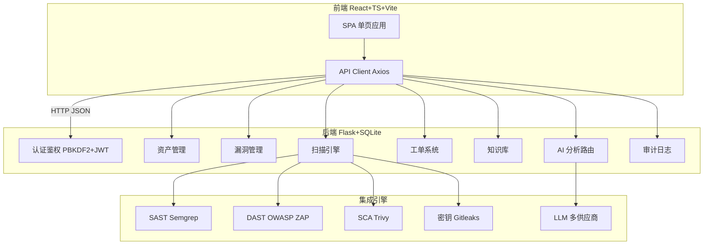

# Sentinel Security Platform（哨兵应用安全平台）

<p align="center">
  <strong>企业级 DevSecOps 应用安全编排平台 v4.0</strong>
  <br><br>
  将资产盘点、漏洞扫描、风险管理、工单流转、AI 辅助分析与安全知识库整合到统一工作流，帮助安全团队在软件开发生命周期（SDLC）全程内嵌安全。
  <br>
  <a href="#screenshots">截图预览</a> ·
  <a href="#features">核心功能</a> ·
  <a href="#quick-start">快速开始</a> ·
  <a href="#architecture">系统架构</a> ·
  <a href="#tech-stack">技术栈</a>
</p>

---

## Screenshots

### 登录页

暗色主题、品牌标识清晰。支持邮箱登录 + JWT Token 认证。



### 工作台仪表盘

一站式安全总览：今日漏洞数、待处理告警、SLA 超时统计、风险评分、修复率趋势。左侧导航覆盖全部 19 个功能模块。



### 漏洞管理

全生命周期管理：发现 → CVSS/CWE 定级 → 修复指派 → 验证关闭 → 闭环。支持筛选、搜索、批量导出 CSV。



### 资产管理

按业务项目组织资产视图，支持新建资产、从项目同步、风险分自动计算。右上角提供 **CSV 导出 / 导入** 批量操作。



### 安全知识库

沉淀检测规则、修复模板与典型案例（20 篇文章，5 大分类）。每篇关联 CWE 编号，与漏洞详情自动联动推荐。



### 扫描中心

多引擎扫描任务调度：SAST（Semgrep / CodeQL）、DAST（OWASP ZAP）、依赖扫描（Trivy）、密钥扫描（Gitleaks）。支持一键发起、查看进度和结果详情。



### AI 辅助分析

对接 OpenAI 兼容 API（支持 Ollama 本地部署 / DeepSeek / 通义千问 / 智谱 GLM / Kimi 等），对每个漏洞生成结构化修复建议、影响分析和代码示例。



### 报告中心

聚合漏洞数据生成报告，支持 JSON / Markdown / CSV / PDF 多格式导出，满足审计与汇报需求。



---

## Features

| 模块 | 能力 |
|------|------|
| **资产与项目管理** | 按业务项目组织资产，统一视图追踪安全状况；支持从代码仓库同步资产清单 |
| **多引擎漏洞扫描** | SAST（Semgrep / CodeQL）、DAST（OWASP ZAP）、依赖扫描（Dependency-Check / Trivy）、密钥扫描（Gitleaks） |
| **漏洞生命周期** | 发现 → 定级（CVSS / CWE）→ 修复 → 验证 → 闭环；支持批量操作和 CSV 导出 |
| **AI 辅助分析** | 对接多家 LLM 供应商（7 种预设），针对漏洞给出修复建议、影响分析和代码示例 |
| **工单流转** | 漏洞一键转工单，可配置优先级、负责人、截止日期，跟踪修复进度 |
| **安全知识库** | 20 篇安全文章覆盖 IDOR / SSRF / 反序列化 / 路径遍历 / XXE / JWT / 供应链 / 容器安全 / 等保 2.0 等主题，CWE 锚定自动联动推荐 |
| **告警与通知** | 可配置告警规则与通知渠道，邮件 / 飞书 webhook 推送 |
| **RBAC 权限模型** | `admin` / `security_analyst` / `developer` / `viewer` 四角色，细粒度权限控制 |
| **审计日志** | 全量操作审计日志，支持 CSV 导出，满足合规追溯要求 |
| **CI/CD 集成** | 流水线安全门禁、定时调度、GitLab CI / GitHub Actions 支持 |
| **资产导入/导出** | CSV 格式批量导入/导出资产清单（UTF-8-SIG，Excel 中文不乱码） |

---

## Architecture



**数据流**: 前端 SPA 通过 Axios 与 Flask RESTful API 通信，所有接口受 JWT 保护。后端通过蓝图(Blueprint)组织 19 个模块，扫描引擎以子进程方式调用外部工具(Semgrep/ZAP/Trivy/Gitleaks)，结果回写数据库。AI 模块动态读取供应商配置，支持热切换 LLM 后端。

---

## Tech Stack

| 层 | 技术 | 说明 |
|----|------|------|
| **后端框架** | Flask 3 (Python 3.11+) | RESTful API，蓝图式模块化 |
| **数据库** | SQLite | 轻量部署，无需外部 DB 服务 |
| **前端框架** | React 18 + TypeScript | 函数组件 + Hooks |
| **构建工具** | Vite 5 | HMR 开发体验，生产构建优化 |
| **样式** | Tailwind CSS | 原子化 CSS，暗色主题 |
| **认证** | PBKDF2-HMAC-SHA256 (~260K轮) + JWT HS256 | `token_version` 支持吊销旧令牌 |
| **加密** | Fernet (cryptography) | API Key 加密存储 |
| **扫描引擎** | Semgrep / CodeQL / ZAP / Trivy / Gitleaks | SAST + DAST + SCA + 密钥 |
| **AI 集成** | OpenAI 兼容 API | 支持 Ollama / DeepSeek / 通义千问 / 智谱 / Kimi / Azure 等 |
| **部署** | Docker / Docker Compose + Nginx | 一键启动，生产级反代 |
| **CI/CD** | GitLab CI / GitHub Actions | 安全门禁流水线模板 |

---

## Quick Start

### 方式一：Docker Compose（推荐）

```bash
git clone https://github.com/carlwuhej-lgtm/sentinel-security.git
cd sentinel-security
docker compose up -d
```

- 前端访问：http://localhost
- 后端 API：http://localhost:5000/api

### 方式二：本地开发

```bash
# 克隆仓库
git clone https://github.com/carlwuhej-lgtm/sentinel-security.git
cd sentinel-security

# ── 后端 ──
cd backend
python -m venv venv
# Windows:
venv\Scripts\activate
# macOS/Linux:
source venv/bin/activate
pip install -r requirements.txt
python run.py          # 启动后端 http://localhost:5000

# ── 前端（另开终端）──
cd frontend
npm install
npm run dev            # 启动开发服务器 http://localhost:5173
```

> **提示**: 生产环境使用 `npm run build` 构建前端，由 Flask 直接托管 `dist/` 目录，只需启动一个端口(5000)即可同时服务前后端。

### 默认管理员

| 账号 | 密码 | 说明 |
|------|------|------|
| `admin@sentinel.io` | `admin123` | **首次登录强制改密** |

注册默认关闭（邀请模式）。管理员可在「用户管理」中创建账号，或在「设置 → 注册策略」中开放公开注册。

---

## Directory Structure

```
sentinel-security/
├── backend/                    # Flask 后端
│   ├── routes/                 # 业务蓝图（19个模块）
│   │   ├── auth.py             # 认证 (JWT/PBKDF2/RBAC)
│   │   ├── assets.py           # 资产管理 (含导入/导出)
│   │   ├── scans.py            # 扫描任务
│   │   ├── vulnerabilities.py  # 漏洞 CRUD
│   │   ├── ai_routes.py        # AI 辅助分析 (多供应商)
│   │   ├── knowledge_base.py   # 知识库文章
│   │   ├── tickets.py          # 工单流转
│   │   ├── audit.py            # 审计日志
│   │   ├── alerts.py           # 告警规则
│   │   ├── reports.py          # 报告生成
│   │   └── ...                 # 其余 10+ 蓝图
│   ├── services/               # 后台服务
│   │   ├── scanner_service.py  # 扫描调度守护线程
│   │   ├── scheduler_service.py # 定时任务守护线程
│   │   ├── notification_service.py # 通知推送
│   │   └── crypto_service.py   # 加密服务 (Fernet)
│   ├── integrations/           # 扫描器集成
│   │   ├── semgrep.py          # Semgrep SAST
│   │   ├── enhanced_scanner.py # 增强扫描器
│   │   └── base.py             # 扫描器基类
│   ├── app.py                  # 应用入口、蓝图注册、SPA 兜底路由
│   ├── config.py               # 配置加载 (.env)
│   ├── restart_backend.sh      # 一键重启脚本
│   └── requirements.txt        # Python 依赖
├── frontend/                   # React 前端
│   ├── src/
│   │   ├── pages/              # 19 个页面组件
│   │   ├── components/         # 通用组件
│   │   ├── api/client.ts       # Axios 封装 (JWT 拦截器)
│   │   └── App.tsx             # 路由定义 (React Router)
│   ├── dist/                   # 生产构建产物 (Flask 托管)
│   └── package.json
├── docs/
│   ├── screenshots/            # 页面截图
│   └── ci-cd-integration.md    # CI/CD 集成指南
├── docker-compose.yml          # Docker 编排
├── Dockerfile.backend          # 后端镜像
├── Dockerfile.frontend         # 前端镜像
├── nginx.conf                  # Nginx 反向代理配置
├── .env.example                # 环境变量示例
└── .gitignore
```

---

## Security Features

- **密码安全**：PBKDF2-HMAC-SHA256（~260,000 轮迭代），向后兼容旧 SHA256 并自动升级
- **Token 安全**：JWT (HS256) + `token_version` 字段支持令牌即时吊销（改密即失效）
- **SQL 注入防护**：所有数据库操作参数化，无字符串拼接 SQL
- **命令注入防护**：子进程调用均使用参数列表（非 shell 字符串拼接）
- **CORS 白名单**：仅允许配置的来源跨域访问
- **API Key 加密**：第三方 API Key 使用 Fernet 对称加密存储，密钥文件 `.encryption_key` 已加入 `.gitignore`
- **RBAC 细粒度**：四角色权限矩阵，接口级权限校验
- **审计追溯**：关键操作（登录/修改/删除/导入/导出）全部记录审计日志
- **结构化日志**：12 个后端模块统一 logging，带时间戳/级别/模块名，便于排查与 SIEM 对接
- **生产加固提醒**：启动时强制检查默认密码、弱 JWT Secret 等安全问题

> **注意**：本项目为公开仓库，**请勿在源码中硬编码任何密钥或凭证**，所有敏感配置请通过环境变量或 `.env` 文件提供。

---

## Documentation

| 文档 | 内容 |
|------|------|
| [CI/CD 集成指南](docs/ci-cd-integration.md) | 流水线安全门禁、GitHub Actions / GitLab CI 模板 |
| [完整使用手册](Sentinel-Security-使用手册.md) | 产品功能详述、角色权限矩阵、运维 FAQ（25KB） |
| [Linux 部署指南](Sentinel-Linux部署指南.md) | 生产环境部署步骤、Nginx 配置、systemd 服务化 |

---

## Contributing

欢迎贡献！无论是 Bug 修复、新功能还是文档改进：

1. Fork 本仓库
2. 创建特性分支 (`git checkout -b feature/amazing`)
3. 提交更改 (`git commit -m 'Add amazing feature'`)
4. 推送到分支 (`git push origin feature/amazing`)
5. 开启 Pull Request

### 开发规范

- Python 遵循 PEP 8，使用 `logging` 替代 `print`
- TypeScript 使用严格模式 (`strict: true`)
- 新增功能需包含对应的单元测试或端到端验证
- 提交信息遵循 Conventional Commits 规范

---

## License

本项目许可证以仓库内 `LICENSE` 文件为准（如未提供，默认保留所有权利）。
